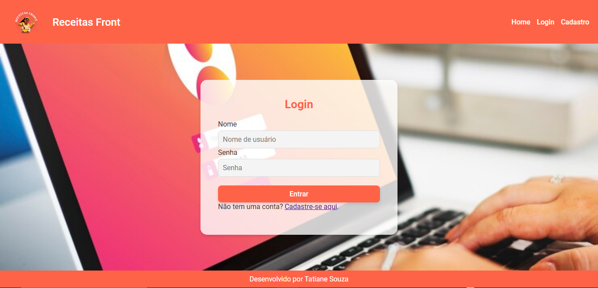

# Receitas Front

## Descrição

O **Receitas Front** é um projeto web que visa implementar um sistema de **cadastro e login de usuários**. A aplicação foi desenvolvida utilizando **HTML**, **CSS**, **JavaScript** para o front-end e **Node.js** com **Express** para o back-end, com banco de dados **MySQL**.

Este projeto tem como objetivo a integração entre front-end e back-end, além da manipulação segura de dados utilizando autenticação JWT e hash de senhas.

## Funcionalidades

- **Cadastro de Usuários**: Permite que os usuários se cadastrem fornecendo nome de usuário, e-mail e senha.
- **Login de Usuários**: Permite que os usuários façam login fornecendo suas credenciais, com verificação de senha segura.
- **Integração Front-End e Back-End**: Comunicação entre a interface do usuário e o banco de dados via API RESTful.

 
## Tecnologias Utilizadas

- **Frontend**: HTML, CSS, JavaScript
- **Backend**: Node.js, Express
- **Banco de Dados**: MySQL
- **Autenticação**: JWT (JSON Web Token)
- **Segurança**: Hashing de Senhas (Bcrypt)

## Instalação

### Pré-requisitos

- Node.js e npm instalados.
- Banco de dados MySQL configurado.

### Passos para Rodar o Projeto

## 1. **Clone o repositório:**
 git clone https://github.com/seu-usuario/receitas-front.git cd receitas-front
 

## 2. **Instale as dependências:**
No diretório do backend, execute:

npm init -y
npm install express

## 3. Configure o banco de dados:

## 4. **Inicie o servidor backend:**
  Após configurar o banco de dados e as variáveis de ambiente, inicie o servidor backend com o comando:
 - node server.js

  
## 5. **Abra o Front-End:**
- Localize o arquivo `frontend/index.html`.
- Abra-o em qualquer navegador.

---

## Rotas da API

### Autenticação
- **POST** `/login`: Realiza o login do usuário.
- **POST** `/register`: Cadastra um novo usuário.

### Perfil
- **GET** `/profile/:userId`: Retorna as informações do perfil do usuário.

---

## Estrutura do Banco de Dados

### Tabela: Usuários
| Campo         | Tipo         | Descrição                          |
|---------------|--------------|------------------------------------|
| `id`          | INT (PK)     | Identificador único do usuário.   |
| `username`    | VARCHAR(50)  | Nome de usuário.                  |
| `senha`       | VARCHAR(255) | Senha criptografada.              |
| `email`       | VARCHAR(100) | E-mail do usuário.                |
| `telefone`    | VARCHAR(15)  | Número de telefone (opcional).    |
| `criado_at`   | TIMESTAMP    | Data de criação do registro.      |

### Tabela: Perfis
| Campo              | Tipo         | Descrição                          |
|---------------------|--------------|------------------------------------|
| `user_id`          | INT (FK)     | Chave estrangeira para `Usuários`. |
| `data_nascimento`  | DATE         | Data de nascimento do usuário.     |
| `foto_perfil`      | VARCHAR(255) | Caminho para a foto do perfil.     |

---

## Considerações Finais

Este projeto faz parte da trilha Cloud do curso Front-End da Proz e visa consolidar conhecimentos sobre:
- Integração de banco de dados com MySQL.
- Autenticação e gerenciamento de usuários.
- Desenvolvimento de APIs RESTful.

---

## Contato

Caso tenha dúvidas ou precise de ajuda, entre em contato:  
📧 **tathyannesg18@gmail.com**

---

Aqui estão as imagens da tela de **Cadastro** e **Login** da nossa API **Receitas Front**:

  
  
  

### Explicação:
- A **primeira imagem** representa a tela de cadastro, onde o usuário pode criar uma conta.
- A **segunda imagem** mostra a tela de login, permitindo que o usuário acesse sua conta existente.

